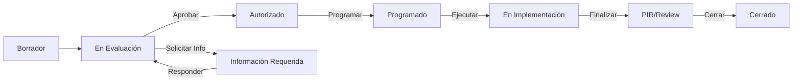

# Manual de Usuario - Sistema de Control de Cambios (ITIL 4)

Este documento describe el flujo operativo para la gestión del ciclo de vida de los cambios en la infraestructura de Proredes.

## 1. Flujo del Proceso

El sistema sigue una máquina de estados estricta diseñada para garantizar la integridad y autorización adecuada de cada cambio.

## 2. Roles y Responsabilidades

- **Solicitante**: Crea el ticket, adjunta evidencias iniciales y responde solicitudes de información.
- **Aprobador (CAB)**: Revisa el riesgo e impacto. Puede autorizar el cambio o solicitar más detalles (bloqueando el flujo).
- **Service Manager**: Supervisa el cumplimiento de los tiempos (Aging) y valida el cierre (PIR).

## 3. Guía Paso a Paso

### 3.1 Creación del Cambio (Estado: Borrador)

1. Complete el **Título** y la **Justificación**.
2. **IMPORTANTE - Programación de la Actividad**:
   Para establecer el control de la actividad, debe definir explícitamente la ventana de tiempo en el campo **Plan de Trabajo**.

   **Formato Estándar Requerido:**
   > Al inicio del campo "Plan de Implementación", escriba la ventana en este formato exacto:
   >
   > **VENTANA DE CAMBIO:**
   > **Inicio:** [Día] [Fecha] [Hora] (Ej: Viernes 12-Ene 22:00 hrs)
   > **Fin:** [Día] [Fecha] [Hora] (Ej: Domingo 14-Ene 13:00 hrs)
   >
   > --- [Detalle técnico del plan continúa aquí] ---

### 3.2 Evaluación y Aprobación

- Si el evaluador cambia el estado a **"Información Requerida"**, el ticket se bloquea para otros aprobadores.
- El solicitante debe adjuntar nuevos documentos (que el sistema etiquetará automáticamente como `V-Actual` moviendo los anteriores a `V-Prev`) o comentar en el Muro de Iteración.
- Al devolver el ticket a "En Evaluación", la versión del cambio se incrementará automáticamente (V1 -> V2).

### 3.3 Ejecución y Cierre

1. **Autorizado -> Programado**: Confirme que los recursos están listos.
2. **Implementación**: Durante esta fase, el sistema permite registrar bitácora en el Muro de Iteración.
3. **PIR (Post-Implementation Review)**:
   - Es **obligatorio** completar el formulario de "Resultado" y "Lecciones Aprendidas".
   - El sistema **no permitirá cerrar el ticket** si estos campos están vacíos.

## 4. Indicadores Visuales

- **Aging (Alerta Roja)**: Si un ticket permanece en estado "Información Requerida" por más de **48 horas**, se marcará en rojo en el Dashboard para atención inmediata.
- **Integridad**: Todos los archivos adjuntos son procesados con SHA256. Cualquier modificación al archivo original invalidará la referencia de seguridad.
